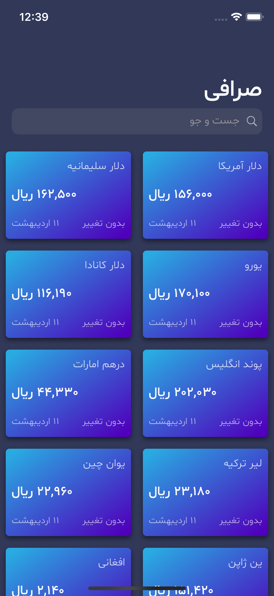
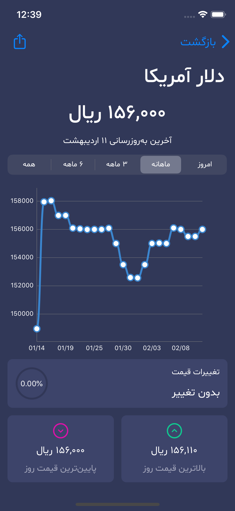
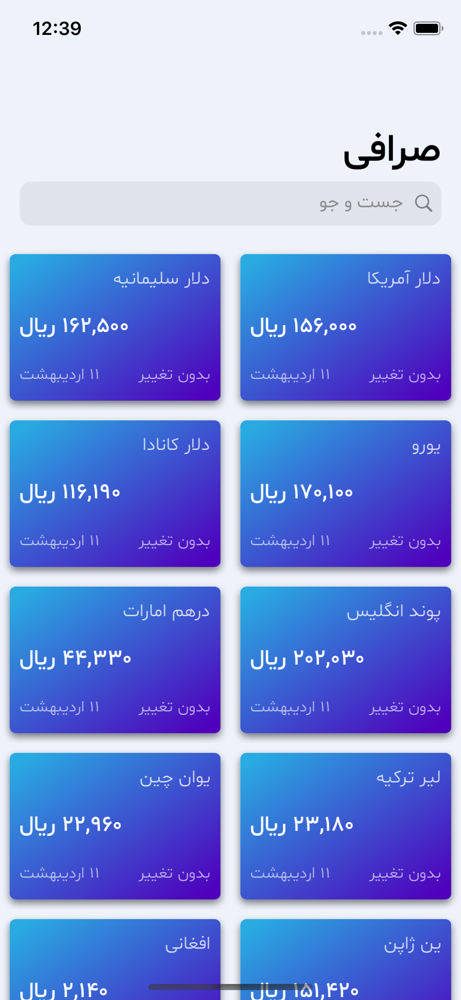
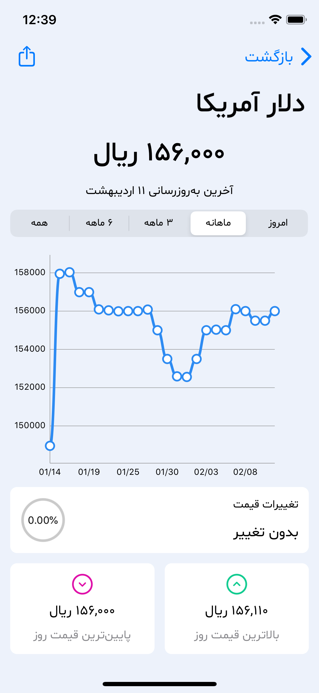

Sarrafi
======

A simple iOS application that shows latest price of currencies, gold, oil and digital currencies.

This project implemented in [Persian language](https://en.wikipedia.org/wiki/Persian_language) and use [tgju.org](http://www.tgju.org/) website API to get the latest prices.

## Features 🌟

- Display the latest prices
- Price chart and other details

## Previews 📱

## How to build 🛠

1- Fork the project & Clone it to your desktop.

2- Open it from Xcode.

3- Change Build identifier.

4- Wait for Swift package dependencies to fetch completely.

5- build & run.

6- enjoy.

## Contribute 🧩

Want to contribute? I would really appreciate a hand with the development to add more features in this app.
Feel free to Fork, edit, then pull!

## Donation ✌🏻

#### Patreon

## Copyright Notice 📝

Copyright (C) 2020 Armin Shalchian

Licensed under the [GNU Version 3](https://www.gnu.org/licenses/gpl-3.0.en.html) license (see the LICENSE file).
